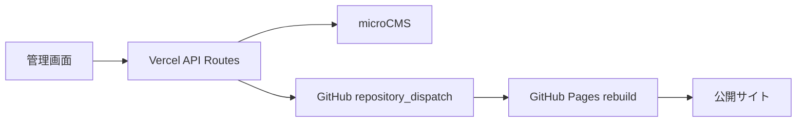

# Bassic. 専用管理画面 v1

`admin-app/` は、納品先がGitHubやAPIキーを触らずに更新するための専用管理画面です。

## 使う場所

- 公開サイト: GitHub Pagesのまま
- 管理画面: Vercelに `admin-app/` だけをデプロイ
- CMS: microCMS

## Vercel設定

VercelのProject SettingsでRoot Directoryを `admin-app` にします。
`admin-app/vercel.json` と `admin-app/package-lock.json` を同梱しているため、Vercelは管理画面だけをNext.jsアプリとしてビルドします。

Environment Variables:

```text
ADMIN_PASSWORD=
ADMIN_SESSION_SECRET=
MICROCMS_SERVICE_DOMAIN=
MICROCMS_API_KEY=
GITHUB_DISPATCH_TOKEN=
GITHUB_OWNER=Token08
GITHUB_REPO=bassic
GITHUB_DISPATCH_EVENT_TYPE=microcms_publish
```

`MICROCMS_API_KEY` はContent APIのGET、POST、PATCHと、Management APIのMedia Uploadを許可します。
microCMS公式のMedia Upload APIは `POST /api/v1/media` で、APIキー露出に注意が必要です。専用管理画面ではキーをブラウザへ出さず、Vercel API Routesだけで使います。

## 納品先の操作

1. 専用管理画面URLを開く。
2. 共有パスワードでログインする。
3. 「店舗情報」「TOP」「イベント」「メニュー」「ドリンク表」「貸切」「SNS告知」「画像」から更新したい場所を選ぶ。
4. 入力後に「プレビュー確認」を見る。
5. まだ公開しない場合は「下書き保存」を押す。
6. 公開する場合は「公開して反映」を押す。

## 反映の流れ



## 確認コマンド

```bash
npm run check:admin-app
npm run typecheck:admin-app
npm run build:admin-app
```

## 注意

- クライアントにはGitHub、GitHub Actions、Vercel、APIキーを触らせない。
- 画像はフォーム内でアップロードする。
- PDFは機材レンタルのPDFリンク欄にURLを入れる。
- microCMSやGitHub dispatchが失敗した場合は、画面に日本語の失敗メッセージを出す。
