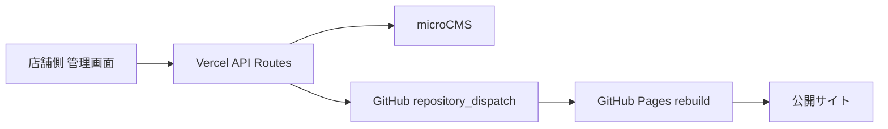

# Bassic. 専用管理画面アプリ v1

`admin-app/` は、納品先がGitHubやAPIキーを触らずにBassic.サイトを更新するための専用管理画面です。

## 推奨構成

- 公開サイト: GitHub Pages
- 管理画面: Vercelに `admin-app/` だけをデプロイ
- CMS: microCMS
- 画像/文章/イベント/メニュー: microCMSで管理
- 公開反映: 管理画面からGitHub Actionsを起動

## Vercel設定

Vercelで新規プロジェクトを作成し、Root Directoryを以下にします。

```text
admin-app
```

必要な環境変数:

```text
ADMIN_PASSWORD=
ADMIN_SESSION_SECRET=
MICROCMS_SERVICE_DOMAIN=
MICROCMS_API_KEY=
GITHUB_DISPATCH_TOKEN=
GITHUB_OWNER=Token08
GITHUB_REPO=bassic
GITHUB_DISPATCH_EVENT_TYPE=microcms_publish
NEXT_PUBLIC_PUBLIC_SITE_URL=https://www.bassic.jp/
```

`NEXT_PUBLIC_PUBLIC_SITE_URL` は本番URLが確定するまでは仮URLでも構いません。後で差し替えられるように環境変数で管理します。

## セキュリティ方針

- `MICROCMS_API_KEY` はブラウザへ出しません。
- GitHubトークンは納品先へ渡しません。
- 店舗側は共有パスワードで管理画面へログインします。
- 画像アップロードや公開反映は、Vercelのサーバー側処理から実行します。

## 店舗側の操作フロー

1. 管理画面URLを開く
2. パスワードでログインする
3. 更新したい項目を選ぶ
4. 入力してプレビューを確認する
5. 下書き保存、またはプレビューして公開を押す
6. 1〜3分ほど待ってから公開サイトを確認する

## 反映の流れ



## 管理画面で優先して作る入力画面

1. 店舗基本情報
2. TOPページ
3. メイン画像
4. イベント
5. フードメニュー
6. ドリンクメニュー表
7. 貸切・レンタル
8. SNSお知らせ

## 確認コマンド

```bash
npm run check:admin-app
npm run typecheck:admin-app
npm run build:admin-app
```

公開サイト側も同時に確認する場合:

```bash
npm run typecheck
npm run build
npm run smoke:links
npm run smoke:seo
```

## 注意

- 管理画面アプリは納品先に「サイトを編集する場所」として渡します。
- microCMSの管理画面を直接使わせる場合でも、項目名は日本語で迷わないようにします。
- GitHub、Vercel、APIキーは制作者または保守担当者が管理します。
